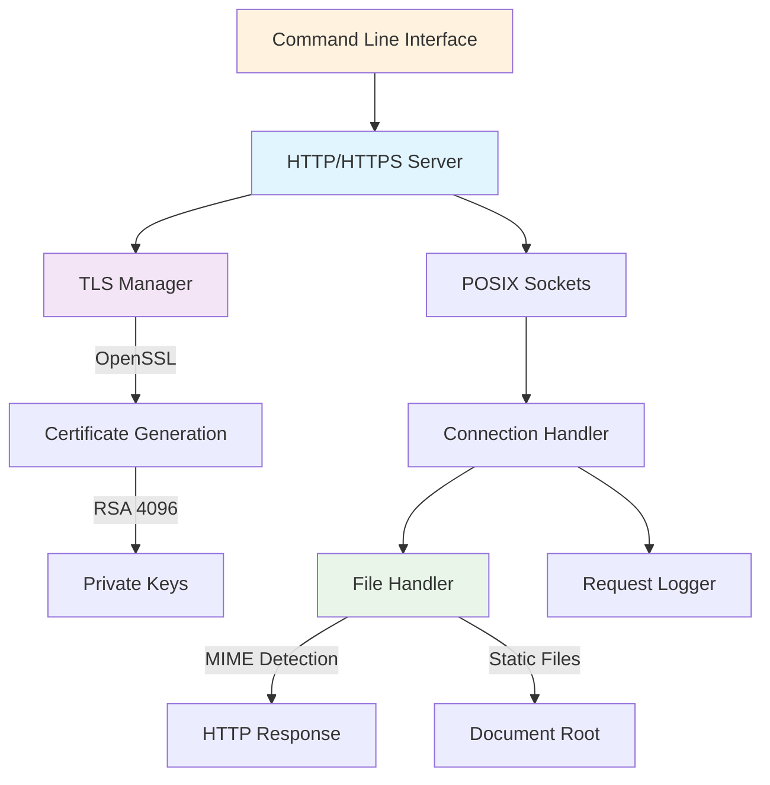

# SwiftServe

[](https://github.com/LTC-GT/SwiftServe/actions/workflows/tests.yml)

**🚀 Cross-Platform HTTP/HTTPS Server in Pure Swift**

A simple, fast, and truly cross-platform HTTP/HTTPS server written in Swift. Designed to work anywhere Swift runs - macOS, Linux, Windows, and more - with zero external dependencies.

⚠️ **ALPHA** - Early Development Release ⚠️

## 🌟 Key Features

### ✅ True Cross-Platform Support
- **POSIX Sockets**: Pure cross-platform networking using POSIX sockets
- **No Platform Dependencies**: Works on macOS, Linux, Windows - anywhere Swift runs
- **Zero External Dependencies**: Uses only Swift Foundation and system libraries
- **Certbot Integration**: Real Let's Encrypt certificates via external certbot tool

### 🔒 Automatic TLS/SSL Support  
- **Let's Encrypt Certificate Issues**
```bash
# Check if certbot is installed
which certbot

# Install certbot (macOS)
brew install certbot

# Install certbot (Ubuntu)
sudo apt-get install certbot

# Install certbot (CentOS)
sudo yum install certbot

# Install certbot (pip)
pip install certbot

# Ensure domain points to your server
nslookup yourdomain.com

# Check port 80 is accessible
sudo ufw allow 80/tcp  # Ubuntu
sudo iptables -A INPUT -p tcp --dport 80 -j ACCEPT  # General Linux
```
- **Self-Signed Certificates**: Automatic generation with RSA 4096-bit keys
- **Subject Alternative Names**: Support for localhost and 127.0.0.1
- **Graceful Fallback**: Falls back to HTTP when OpenSSL unavailable
- **90-day Certificates**: Industry-standard validity period

### 📁 Static File Serving
- **MIME Type Detection**: Automatic content-type detection
- **Index Files**: Auto-serve `index.html` for directories  
- **Path Sanitization**: Security-focused path validation
- **Custom 404 Pages**: Helpful error responses

### 🛠️ Developer Experience
- **Comprehensive Logging**: Detailed request/response logging
- **73 Test Suite**: Extensive test coverage for reliability
- **Performance Optimized**: Concurrent connection handling
- **Easy Configuration**: Simple command-line interface

## 📊 Architecture Overview



## 🚀 Quick Start

### Installation

```bash
# Clone the repository
git clone https://github.com/LTC-GT/SwiftServe.git
cd SwiftServe

# Build the server
swift build -c release

# Run the server
swift run SwiftServe
```

### Basic Usage

```bash
# HTTP server on port 8080
swift run SwiftServe

# HTTPS server with self-signed certificate
swift run SwiftServe --https

# HTTPS server with real Let's Encrypt certificate
swift run SwiftServe --letsencrypt --domain example.com --email admin@example.com

# Custom port and document root
swift run SwiftServe --port 3000 --root ./public

# Debug mode with detailed logging
swift run SwiftServe --debug
```

## 🔒 TLS/SSL Certificate Management

SwiftServe supports both self-signed certificates for development and Let's Encrypt certificates for production:

### Self-Signed Certificates (Development)
```bash
# Enable HTTPS with automatic self-signed certificate generation
swift run SwiftServe --https
```

### Real Let's Encrypt Certificates (Production)
```bash
# Install certbot first
# macOS:
brew install certbot

# Ubuntu/Debian:
sudo apt-get install certbot

# CentOS/RHEL:
sudo yum install certbot

# Or via pip:
pip install certbot

# Get real Let's Encrypt certificate
swift run SwiftServe --letsencrypt --domain yourdomain.com --email admin@yourdomain.com
```

**Requirements for Let's Encrypt:**
- Domain must point to your server
- Server must be accessible on port 80 for HTTP-01 challenge
- Certbot must be installed (`pip install certbot`)

**Certificate Renewal:**
Let's Encrypt certificates expire every 90 days. Certbot handles automatic renewal:
```bash
# Setup automatic renewal (recommended)
sudo crontab -e
# Add this line to run renewal check twice daily:
# 0 12,0 * * * certbot renew --quiet

# Manual renewal check
certbot renew --dry-run  # Test renewal
certbot renew            # Actually renew if needed
```

**Self-Signed Certificate Details:**
- **Algorithm**: RSA 4096-bit keys
- **Validity**: 90 days (renewable)
- **Subject**: localhost with example@example.com email
- **SAN**: localhost, 127.0.0.1
- **Format**: Let's Encrypt-compatible

**Generated Files:**
- `localhost.crt` - TLS certificate (self-signed)
- `localhost.key` - RSA private key (self-signed)
- `/etc/letsencrypt/live/domain/` - Let's Encrypt certificates

## 🧪 Testing

SwiftServe includes a comprehensive test suite:

```bash
# Run all tests
swift test

# Run specific test suites
swift test --filter HTTPServerTests
swift test --filter TLSTests

# Test with verbose output
swift test -v
```

**Test Coverage:**
- **73 Total Tests** across 6 test suites
- **CaddyConfig**: 50 tests
- **FileHandler**: 8 tests  
- **HTTPServer**: 8 tests
- **Logger**: 15 tests
- **SwiftServe**: 2 tests
- **TLS**: 6 tests

## 🔧 Configuration Options

### Command Line Arguments

| Option | Description | Default |
|--------|-------------|---------|
| `--port` | Server port | 8080 (HTTP), 8443 (HTTPS) |
| `--root` | Document root directory | `./serve` |
| `--https` | Enable HTTPS with self-signed certificate | HTTP only |
| `--letsencrypt` | Enable HTTPS with real Let's Encrypt certificate | HTTP only |
| `--domain` | Domain name for Let's Encrypt certificate | None |
| `--email` | Email address for Let's Encrypt registration | example@example.com |
| `--debug` | Enable detailed logging | Disabled |
| `--help` | Show help message | - |

### Environment Variables

```bash
# Set custom email for certificates
export SWIFTSERVE_EMAIL="your@email.com"

# Custom certificate validity (days)
export SWIFTSERVE_CERT_DAYS="365"
```

## 📁 Project Structure

```
SwiftServe/
├── Sources/SwiftServe/
│   ├── main.swift          # Entry point and CLI parsing
│   ├── HTTPServer.swift    # Cross-platform HTTP/HTTPS server
│   ├── TLSManager.swift    # TLS certificate management
│   ├── FileHandler.swift   # Static file serving logic
│   ├── Logger.swift        # Logging utilities
│   └── CaddyConfig.swift   # Configuration file parser
├── Tests/SwiftServeTests/  # Comprehensive test suite
│   ├── HTTPServerTests.swift
│   ├── TLSTests.swift
│   ├── FileHandlerTests.swift
│   ├── LoggerTests.swift
│   ├── CaddyConfigTests.swift
│   └── SwiftServeTests.swift
├── serve/                  # Default web root directory
│   └── index.html          # Demo page
├── Package.swift           # Swift Package Manager config
├── Caddyfile              # Example configuration
└── README.md              # This file
```

## 🔧 Development

### Requirements

- **Swift 5.9+**: Works on any platform with Swift support
- **OpenSSL**: For TLS certificate generation (optional)
- **POSIX System**: Any POSIX-compliant OS (macOS, Linux, Windows WSL, etc.)

### Building for Development

```bash
# Run directly with Swift
swift run SwiftServe --debug

# Build debug version
swift build
.build/debug/SwiftServe --help

# Build release version
swift build -c release
.build/release/SwiftServe --help
```

### Creating Distributable Binary

```bash
# Build optimized release
swift build -c release

# Create distribution package
mkdir -p dist
cp .build/release/SwiftServe dist/
tar -czf SwiftServe.tar.gz -C dist SwiftServe
```

### Running Tests

```bash
# Run all tests
swift test

# Run with coverage (if available)
swift test --enable-code-coverage

# Run specific test class
swift test --filter TLSTests
```

## 🌐 Cross-Platform Compatibility

SwiftServe is designed to work on any platform where Swift is available:

### ✅ Tested Platforms
- **macOS** (Intel & Apple Silicon)
- **Linux** (Ubuntu, CentOS, Alpine)
- **Windows** (with Swift for Windows)

### 🔄 Continuous Integration
GitHub Actions automatically tests on:
- macOS (latest)
- Ubuntu (latest)

## 📝 API Documentation

### HTTP Server Methods

```swift
// Create HTTP server
let server = HTTPServer(port: 8080, root: "./serve")

// Create HTTPS server with TLS
let tlsManager = TLSManager()
let httpsServer = HTTPServer(port: 8443, root: "./serve", tlsManager: tlsManager)

// Start server
try server.start()
```

### TLS Manager

```swift
// Generate certificates
let tlsManager = TLSManager()
try tlsManager.generateSelfSignedCertificate(for: "localhost", email: "example@example.com")

// Setup TLS context
let context = try tlsManager.setupTLSContext()
```

## 🐛 Troubleshooting

### Common Issues

**Certificate Generation Fails**
```bash
# Check if OpenSSL is available
which openssl

# Install OpenSSL if missing (macOS)
brew install openssl

# Install OpenSSL if missing (Ubuntu)
sudo apt-get install openssl
```

**Let's Encrypt Certificate Issues**
```bash
# Check if certbot is installed
which certbot

# Install certbot (pip)
pip install certbot

# Install certbot (Ubuntu)
sudo apt-get install certbot

# Install certbot (macOS)
brew install certbot

# Ensure domain points to your server
nslookup yourdomain.com

# Check port 80 is accessible
sudo ufw allow 80/tcp  # Ubuntu
sudo iptables -A INPUT -p tcp --dport 80 -j ACCEPT  # General Linux
```

**Permission Denied on Port 80/443**
```bash
# Use unprivileged ports for development
swift run SwiftServe --port 8080

# Or run with sudo (not recommended for development)
sudo swift run SwiftServe --port 80
```

**File Not Found Errors**
```bash
# Check document root exists
ls -la ./serve

# Create default document root
mkdir -p serve
echo "<h1>Hello SwiftServe!</h1>" > serve/index.html
```

## 🤝 Contributing

Contributions are welcome! Please feel free to submit a Pull Request.

### Development Workflow

1. Fork the repository
2. Create a feature branch: `git checkout -b feature/amazing-feature`
3. Make your changes
4. Run tests: `swift test`
5. Commit changes: `git commit -m 'Add amazing feature'`
6. Push to branch: `git push origin feature/amazing-feature`
7. Open a Pull Request

### Code Style

- Follow Swift conventions
- Add tests for new features
- Update documentation as needed
- Ensure cross-platform compatibility

## 📄 License

This project is licensed under the GNU Lesser General Public License v3.0 - see the [LICENSE.md](LICENSE.md) file for details.

## 🙏 Acknowledgments

Made with ❤️ in Atlanta, Georgia  
Project created by [LibreTech Collective](https://sites.gatech.edu/gtltc/) at the [Georgia Institute of Technology](https://gatech.edu)

## 📈 Roadmap

- [ ] Advanced routing and URL rewriting
- [ ] Reverse proxy support
- [ ] WebSocket support
- [ ] HTTP/2 implementation
- [ ] Performance benchmarking
- [x] Real Let's Encrypt integration
- [ ] Plugin system architecture
