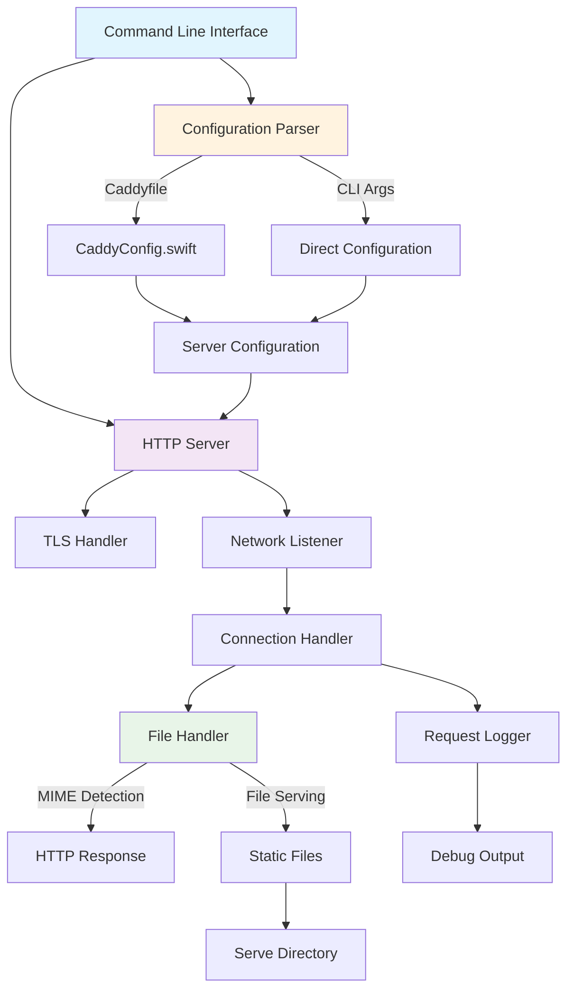

# SwiftServe

**⚠️ ALPHA VERSION 0.1 - Early Development Release ⚠️**

A simple, fast HTTP/HTTPS server written in Swift - designed to mimic functionality provided in Caddy using only Apple's frameworks from the `Foundation` and `Network` libraries.

## Architecture Overview



## Caddy Compatibility

SwiftServe implements a **subset** of Caddy's configuration format, focusing on static file serving:

### ✅ Supported Caddyfile Features
- **Site blocks**: `localhost:8080 { ... }`
- **Root directive**: `root * /path/to/files` or `root /path/to/files`
- **TLS directive**: `tls internal` (self-signed certificates)
- **Global debug**: `debug` (top-level directive)
- **Multiple sites**: Multiple server blocks (basic support)

### ❌ Not Yet Supported
- Custom TLS certificates
- Reverse proxy
- URL rewriting
- Advanced routing
- Middleware plugins
- Environment variables in config

### Example Caddyfile
```
# Global debug logging
debug

# HTTP server
localhost:8080 {
    root * serve
}

# HTTPS server with self-signed cert
localhost:8443 {
    root * serve
    tls internal
}
```

## Features

### Core Functionality
- 🚀 **HTTP/1.1 Server**: Full HTTP implementation with proper status codes
- 🔒 **HTTPS Support**: Automatic self-signed certificate generation using Apple's Security framework
- 📁 **Static File Serving**: Serves files with automatic MIME type detection
- 🎯 **Zero Dependencies**: Pure Swift implementation using only Foundation and Network frameworks

### Configuration & CLI
- ⚙️ **Caddyfile Support**: Parse and use Caddy-style configuration files
- 🖥️ **Rich CLI**: Comprehensive command-line interface with help system
- � **Flexible Root**: Configurable document root directory
- 🔧 **Multiple Sites**: Basic support for multiple server configurations

### Development & Debugging
- 📊 **Debug Logging**: Detailed request/response logging with client information
- 🌐 **Network Diagnostics**: Connection tracking and performance metrics
- 🛡️ **Security Headers**: Basic security response headers
- ⚡ **Performance**: Async I/O using Apple's Network framework

### File Handling
- 🎨 **MIME Detection**: Automatic content-type detection for common file types
- 📄 **Index Files**: Automatic `index.html` serving for directories
- 🚫 **404 Handling**: Custom 404 error pages with helpful information
- 🔍 **Path Sanitization**: Security-focused path validation and sanitization

## Installation

### Building from Source

```bash
# Clone the repository
git clone https://github.com/LTC-GT/SwiftServe.git
cd SwiftServe

# Build the executable
swift build -c release

# The binary will be available at:
.build/release/SwiftServe
```

### Binary Distribution

To create a distributable binary:

```bash
# Build for release
swift build -c release

# Copy the binary to a distribution directory
mkdir -p dist
cp .build/release/SwiftServe dist/

# Create a tar.gz for distribution
tar -czf SwiftServe.tar.gz -C dist SwiftServe
```

## Usage

### Basic Usage

```bash
# Start HTTP server on port 8080 (serves from ./serve directory)
./SwiftServe

# Start with debug logging
./SwiftServe --debug

# Start HTTPS server on port 8443
./SwiftServe --https

# Serve from custom directory
./SwiftServe --root ./public

# Use custom port
./SwiftServe --port 3000
```

### Configuration File

Create a `Caddyfile` in the same directory as the executable:

```
# HTTP server
localhost:8080 {
    root * serve
}

# HTTPS server (uncomment to enable)
# localhost:8443 {
#     root * serve
#     tls internal
# }

# Enable debug logging
debug
```

Then run:

```bash
./SwiftServe --config ./Caddyfile
```

### Command Line Options

- `-d, --debug`: Enable debug mode with detailed packet logging
- `-s, --https`: Enable HTTPS with self-signed certificate
- `-p, --port PORT`: Specify port number (default: 8080 for HTTP, 8443 for HTTPS)
- `-r, --root DIR`: Specify root directory to serve files from (default: serve)
- `-c, --config FILE`: Use a Caddyfile-style configuration file
- `-h, --help`: Show help message

## Development

### Project Structure

```
SwiftServe/
├── Sources/SwiftServe/
│   ├── main.swift          # Entry point and CLI parsing
│   ├── HTTPServer.swift    # HTTP/HTTPS server implementation
│   ├── FileHandler.swift   # Static file serving logic
│   ├── Logger.swift        # Logging utilities
│   └── CaddyConfig.swift   # Configuration file parser
├── serve/                  # Default web root directory
│   └── index.html          # Demo page
├── Package.swift           # Swift Package Manager configuration
├── Caddyfile               # Example configuration
└── LICENSE                 # LGPLv3 License
```

### Requirements

- Works on any OS supporting Swift (Built on macOS 26 Tahoe)
- Swift (and compiler) version 5.9 or later

### Building for Development

```bash
# Run directly with Swift
swift run SwiftServe --debug

# Build and run
swift build
.build/debug/SwiftServe --help
```

### Creating SSL Certificates

For HTTPS, SwiftServe automatically generates self-signed certificates for localhost. In production use, replace with proper certificates generated with SwiftServe via the `--https` flag.

## License

This project is licensed under the GNU Lesser General Public License v3.0 - see the [LICENSE](LICENSE) file for details.

## Acknowledgments

Made with ❤️ in Atlanta, Georgia  
Project created at the [LibreTech Collective](https://sites.gatech.edu/gtltc/) at [Georgia Institute of Technology](https://gatech.edu)

## Contributing

Contributions are always welcome! Please feel free to submit a Pull Request and we'll review it as soon as possible. Thanks for making SwiftServe better!